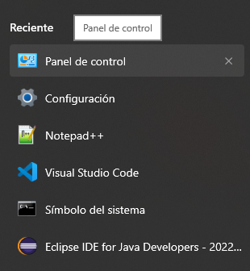
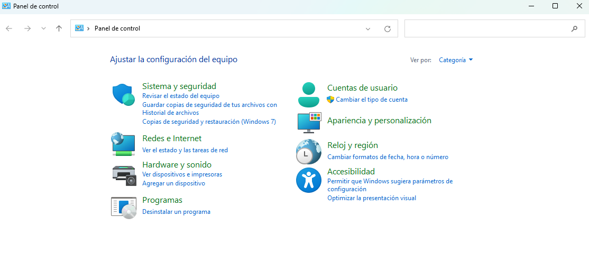
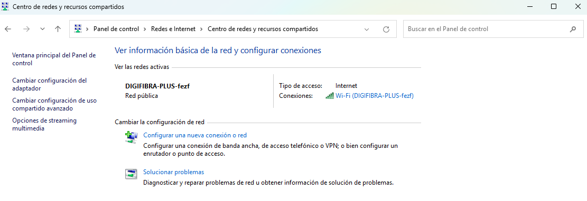
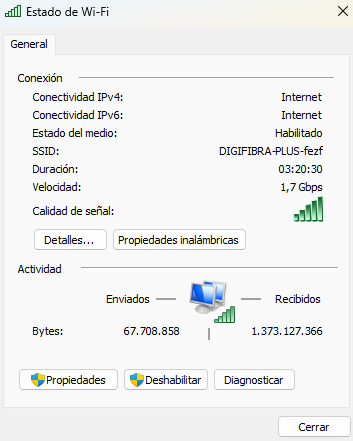
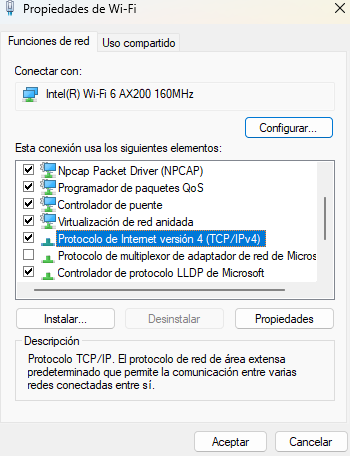
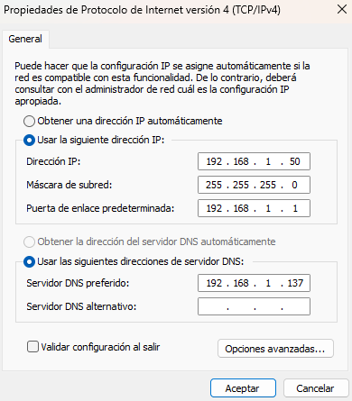

# 🎓 Trabajo Fin de Grado - DNS Cache Viewer  
Configuración de un servidor **BIND9** en Debian para usarlo como DNS en una red local.  

---

## 🛠️ **Paso 1: Instalar BIND9 en Debian**  

> 📌 **NOTA:** Asegúrate de tener privilegios de superusuario antes de ejecutar los comandos.

1. Activa el modo superusuario con:  
```
su
```

2. Para instalar BIND9, ejecuta estos comandos en la máquina virtual con Debian:
```
sudo apt update && sudo apt install bind9 -y
```

3. Verifica que el servicio está corriendo:
```
sudo systemctl status bind9
```

4. Si no está activo, inícialo con:
```bash
sudo systemctl start bind9
sudo systemctl enable bind9
```


## ⚙️ **Paso 2: Configurar BIND9 como Servidor DNS**

5. Edita el archivo de configuración principal:
```bash
sudo nano /etc/bind/named.conf.options
```

6. Busca la sección `options` y ajusta los siguientes parámetros:
```bash
options {
    directory "/var/cache/bind";
    listen-on { any; };  // Asegura que escuche en todas las interfaces
    allow-query { any; };  // Permite consultas desde cualquier equipo
    recursion yes;
    forwarders {
        8.8.8.8;
        8.8.4.4;
    };
};
```

7. Guarda y cierra el archivo (Ctrl + X, luego Y y Enter).

## 🌍 **Paso 3: Configurar una Zona DNS**
>⚠️ **IMPORTANTE**: Usa un dominio que no entre en conflicto con dominios públicos. Se recomienda .local para redes privadas.

8. Edita el archivo de zonas:
```bash
sudo nano /etc/bind/named.conf.local
```

9. Añade la configuración para una zona DNS, por ejemplo, **joanamoros23.local**:

```bash
zone "joanamoros23.local" {
    type master;
    file "/etc/bind/db.joanamoros23.local";
};
```

10. Guarda y cierra el archivo (`Ctrl + X`, luego `Y` y `Enter`).
    
11. Crea el archivo de la zona:

```bash
sudo cp /etc/bind/db.empty /etc/bind/db.joanamoros23.local
sudo nano /etc/bind/db.joanamoros23.local
```

12. Edita el archivo y ajústalo con tu configuración:
```bash
$TTL    86400
@       IN      SOA     joanamoros23.local. admin.joanamoros23.local. (
                        2024030201   ; Serial
                        3600         ; Refresh
                        1800         ; Retry
                        604800       ; Expire
                        86400 )      ; Minimum TTL

        IN      NS      ns.joanamoros23.local.
ns      IN      A       192.168.1.137  ; IP del servidor DNS
pc      IN      A       192.168.1.50   ; IP del PC de sobremesa
```

13. Guarda y cierra el archivo (Ctrl + X, luego Y y Enter).


## 🔄 **Paso 4: Configurar Resolución Inversa (Opcional)**
>⚠️ **ADVERTENCIA**: La resolución inversa permite traducir IPs a nombres de dominio. No es obligatoria, pero puede ser útil.

14. Si quieres configurar resolución inversa (IP a nombre de dominio), edita `/etc/bind/named.conf.local`:
```bash
sudo nano /etc/bind/named.conf.local
```

15. Añade:
```bash
zone "1.168.192.in-addr.arpa" {
    type master;
    file "/etc/bind/db.192";
};
```

16. Guarda y cierra el archivo (`Ctrl + X`, luego `Y` y `Enter`).

17. Crea el archivo de la zona: 
```bash
sudo cp /etc/bind/db.empty /etc/bind/db.192
sudo nano /etc/bind/db.192
```

18. Añade esta configuración:
```bash
$TTL    86400
@       IN      SOA     joanamoros23.local. admin.joanamoros23.local. (
                        2024030201   ; Serial
                        3600         ; Refresh
                        1800         ; Retry
                        604800       ; Expire
                        86400 )      ; Minimum TTL

        IN      NS      ns.joanamoros23.local.
100     IN      PTR     ns.joanamoros23.local.
50      IN      PTR     pc.joanamoros23.local.
```

19. Guarda y cierra el archivo (`Ctrl + X`, luego `Y` y `Enter`).


## 🔄 **Paso 5: Reiniciar BIND9 y Verificar**

20. Aplica los cambios:
```bash
sudo systemctl restart bind9
sudo systemctl status bind9
```

21. Verifica la configuración con:
```bash
sudo named-checkconf
sudo named-checkzone joanamoros23.local /etc/bind/db.joanamoros23.local
sudo named-checkzone 1.168.192.in-addr.arpa /etc/bind/db.192
```

22. Si todo está bien, deberíamos ver:
```bash
zone joanamoros23.local/IN: loaded serial 2024030201
OK
```
```bash
zone 1.168.192.in-addr.arpa/IN: loaded serial 2024030201
OK
```

## 💻 **Paso 6: Configurar el PC de sobremesa para usar el DNS**

En Windows:

1. Abre **Configuración > Red e Internet > Cambiar opciones del adaptador**.
2. Haz clic derecho en tu conexión de red > **Propiedades**.
3. Selecciona **Protocolo de Internet versión 4 (TCP/IPv4)** y haz clic en **Propiedades**.
4. Configura:
    - **Dirección IP**: `192.168.1.50`
    - **Máscara de subred**: `255.255.255.0`
    - **Puerta de enlace**: `192.168.1.1`
    - **Servidor DNS preferido**: `192.168.1.137`
5. Guarda los cambios.

También puedes acceder a esta configuración a través del **Panel de control**:

**Panel de control → Redes e Internet → Conexiones (estado de WiFi) → Propiedades → Protocolo de Internet IPv4 → Propiedades**

<p align="center">
  
</p>
<p align="center">
  
</p>
<p align="center">
  
</p>
<p align="center">
  
</p>
<p align="center">
  
</p>
<p align="center">
  
</p>


## 🛠️ **Paso 7: Probar la Configuración**  

En el **PC de sobremesa**, prueba si puede resolver nombres con:

```powershell
nslookup pc.joanamoros23.local 192.168.1.137
```

O en Linux, usa dig:
```powershell
dig @192.168.1.137 pc.joanamoros23.local
```

✅ Si devuelve la IP configurada, el servidor DNS está funcionando correctamente. 
