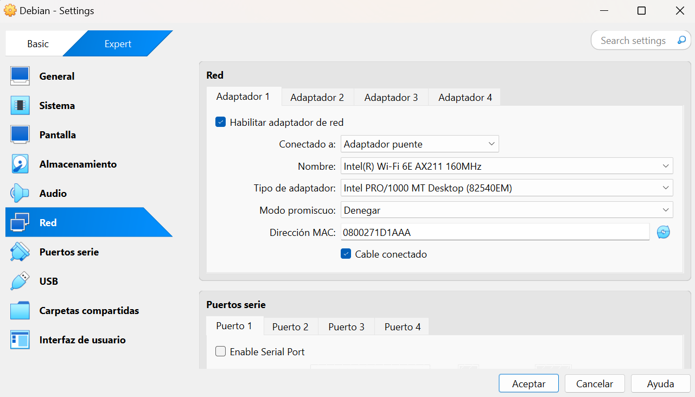

# 🎓 Trabajo Fin de Grado - DNS Cache Viewer  
Configuración de un servidor **BIND9** en Debian para usarlo como DNS en una red local.  

---

## 🛠️ **Paso 1: Instalar BIND9 en Debian**  

> 📌 **NOTA:** Asegúrate de tener privilegios de superusuario antes de ejecutar los comandos.

1. Activa el modo superusuario con:  
```
su
```

2. Para instalar BIND9, ejecuta estos comandos en la máquina virtual con Debian:
```
sudo apt update && sudo apt install bind9 -y
```

3. Verifica que el servicio está corriendo:
```
sudo systemctl status bind9
```

4. Si no está activo, inícialo con:
```bash
sudo systemctl start bind9
sudo systemctl enable bind9
```


## ⚙️ **Paso 2: Configurar BIND9 como servidor DNS**

5. Edita el archivo de configuración principal:
```bash
sudo nano /etc/bind/named.conf.options
```

6. Busca la sección `options` y ajusta los siguientes parámetros:
```bash
options {
    directory "/var/cache/bind";
    listen-on { any; };  // Asegura que escuche en todas las interfaces
    allow-query { any; };  // Permite consultas desde cualquier equipo
    recursion yes;
    forwarders {
        8.8.8.8;
        8.8.4.4;
    };
};
```

7. Guarda y cierra el archivo (Ctrl + X, luego Y y Enter).

## 🌍 **Paso 3: Configurar una zona DNS**
>⚠️ **IMPORTANTE**: Usa un dominio que no entre en conflicto con dominios públicos. Se recomienda .local para redes privadas.

8. Edita el archivo de zonas:
```bash
sudo nano /etc/bind/named.conf.local
```

9. Añade la configuración para una zona DNS, por ejemplo, **joanamoros23.home**:

```bash
zone "joanamoros23.home" {
    type master;
    file "/etc/bind/db.joanamoros23.home";
};
```

10. Guarda y cierra el archivo (`Ctrl + X`, luego `Y` y `Enter`).
    
11. Crea el archivo de la zona:

```bash
sudo cp /etc/bind/db.empty /etc/bind/db.joanamoros23.home
sudo nano /etc/bind/db.joanamoros23.home
```

12. Edita el archivo y ajústalo con tu configuración:
```bash
$TTL    86400
@       IN      SOA     joanamoros23.home. root.joanamoros23.home. (
                              3         ; Serial (incrementa en cada cambio)
                         604800         ; Refresh
                          86400         ; Retry
                        2419200         ; Expire
                          86400 )       ; Negative Cache TTL
;
@       IN      NS      ns.joanamoros23.home.

ns      IN      A       192.168.1.137   ; Dirección del servidor DNS (BIND)
@       IN      A       192.168.1.137   ; Dirección del dominio principal

pc      IN      A       192.168.1.50    ; Dirección del PC de sobremesa
```

13. Guarda y cierra el archivo (Ctrl + X, luego Y y Enter).


## 🔄 **Paso 4: Configurar resolución inversa (opcional)**
>⚠️ **ADVERTENCIA**: La resolución inversa permite traducir IPs a nombres de dominio. No es obligatoria, pero puede ser útil.

14. Si quieres configurar resolución inversa (IP a nombre de dominio), edita `/etc/bind/named.conf.local`:
```bash
sudo nano /etc/bind/named.conf.local
```

15. Añade:
```bash
zone "1.168.192.in-addr.arpa" {
    type master;
    file "/etc/bind/db.192";
};
```

16. Guarda y cierra el archivo (`Ctrl + X`, luego `Y` y `Enter`).

17. Crea el archivo de la zona: 
```bash
sudo cp /etc/bind/db.empty /etc/bind/db.192
sudo nano /etc/bind/db.192
```

18. Añade esta configuración:
```bash
$TTL    86400
@       IN      SOA     joanamoros23.home. root.joanamoros23.home. (
                              2         ; Serial (incrementa este número en cada cambio)
                         604800         ; Refresh
                          86400         ; Retry
                        2419200         ; Expire
                          86400 )       ; Negative Cache TTL
;
@       IN      NS      ns.joanamoros23.home.

137     IN      PTR     joanamoros23.home.   ; Resolución inversa del servidor DNS
50      IN      PTR     pc.joanamoros23.home.  ; Resolución inversa del PC de sobremesa

```

19. Guarda y cierra el archivo (`Ctrl + X`, luego `Y` y `Enter`).


## 🔄 **Paso 5: Reiniciar BIND9 y verificar**

20. Aplica los cambios:
```bash
sudo systemctl restart bind9
sudo systemctl status bind9
```

21. Verifica la configuración con:
```bash
sudo named-checkconf
sudo named-checkzone joanamoros23.home /etc/bind/db.joanamoros23.home
sudo named-checkzone 1.168.192.in-addr.arpa /etc/bind/db.192
```

22. Si todo está bien, deberíamos ver:
```bash
zone joanamoros23.home/IN: loaded serial 3
OK
```
```bash
zone 1.168.192.in-addr.arpa/IN: loaded serial 2
OK
```

## 💻 **Paso 6: Configurar el PC de sobremesa para usar el DNS**

En Windows:

1. Abre **Configuración > Red e Internet > Cambiar opciones del adaptador**.
2. Haz clic derecho en tu conexión de red > **Propiedades**.
3. Selecciona **Protocolo de Internet versión 4 (TCP/IPv4)** y haz clic en **Propiedades**.
4. Configura:
    - **Dirección IP**: `192.168.1.50`
    - **Máscara de subred**: `255.255.255.0`
    - **Puerta de enlace**: `192.168.1.1`
    - **Servidor DNS preferido**: `192.168.1.137`
5. Guarda los cambios.

También puedes acceder a esta configuración a través del **Panel de control**:

**Panel de control → Redes e Internet → Conexiones (estado de WiFi) → Propiedades → Protocolo de Internet IPv4 → Propiedades**

<p align="center">
  
</p>
<p align="center">
  
</p>
<p align="center">
  
</p>
<p align="center">
  
</p>
<p align="center">
  
</p>
<p align="center">
  
</p>


## 🛠️ **Paso 7: Probar la Configuración**  

En el **PC de sobremesa**, prueba si puede resolver nombres con:

```powershell
nslookup pc.joanamoros23.home 192.168.1.137
```

O en Linux, usa dig:
```powershell
dig @192.168.1.137 pc.joanamoros23.home
```

✅ Si devuelve la IP configurada, el servidor DNS está funcionando correctamente. 


---

## ⚠️ **Posibles problemas y soluciones**

### 🛠 **1. Verificar la configuración de red de la máquina virtual**
Si el PC de sobremesa no puede resolver nombres, verifica la configuración de red de tu máquina virtual.

**📌 Solución:**

Asegúrate de que la máquina virtual está en modo puente o en la misma red que el PC de sobremesa.
En VirtualBox:
Ve a **Configuración > Red.**
Asegúrate de que la interfaz de red está en **"Adaptador puente"**.
Guarda los cambios y reinicia la máquina virtual.
<p align="center">
  
</p>


### 🔍 **2. Comprobar la IP de la máquina virtual**
Ejecuta en la máquina virtual:

```bash
ip a | grep inet
```

Ejemplo de salida esperada:
```bash
inet 127.0.0.1/8 scope host lo  
inet6 ::1/128 scope host noprefixroute  
inet 192.168.1.137/24 brd 192.168.1.255 scope global dynamic noprefixroute enp0s3  
```

**📌 Solución:**
- La dirección 192.168.1.137 debe estar en la misma subred que el PC de sobremesa.
- Si no tienes una IP en este rango, cambia la configuración de red en VirtualBox.


### **🌍 3. Verificar la resolución de nombres en el PC de sobremesa**
Ejecuta:
```bash
nslookup pc.joanamoros23.home 192.168.1.137
```

Si devuelve algo como esto, el DNS funciona correctamente:
```bash
Servidor:  joanamoros23.home  
Address:  192.168.1.137  

Nombre:  pc.joanamoros23.home  
Address:  192.168.1.50  
```

### **🔁 4. Asegurar que Windows Usa el DNS correctamente**
Para verificar que Windows usa el DNS, ejecuta:
```bash
nslookup google.com 192.168.1.137
```

Ejemplo de salida esperada: 
```bash
Servidor:  UnKnown  
Address:  192.168.1.137  

Respuesta no autoritativa:  
Nombre:  google.com  
Addresses:  2a00:1450:4003:80d::200e  
          142.250.184.174  
```

- **"Respuesta no autoritativa"** indica que el servidor está reenviando consultas a otros DNS (Google, Cloudflare).


